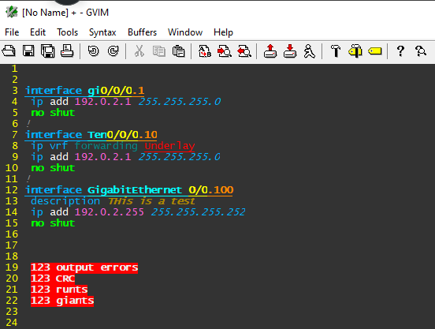

# network_commands
Random Network Commands - Notes To Self

Need a place to keep notes about random network commands.  I have been posting commands to Twitter for a while.  Some of the commands have brief explanations.  Some of the commands are undocumented.

## VIM
Cisco.vim is now version .629.

Added syntax highlighting for the "interface range" command.


## VIM
Been using VIM when creating and editing device configurations to point out typos and mistakes.  The syntax highlighting has more features and options when compared to regex available in SecureCRT.  Mostly because of the ability to create groups and call nextgroup.  This allows things such as interface names be given one color, interface numbers be given a second color, and subinterfaces be given a third color.  Also, the ability to set both a forground color and a backgroup color is really nice.



Started making changes to the VIM syntax configuration file for Cisco.  Calling it version .628 for now.

Drop **cisco.vim** into **C:\Program Files\Vim\vim91\syntax** or the syntax directory of wherever it's been installed.

The original file, version .627, can be found here.

https://www.vim.org/scripts/script.php?script_id=4624

Highlight cisco configuration files.
```
set syntax=cisco
```

Fix a font bug where italic characters get cut off.
```
set guifont=Consolas:h12:cANSI:qDRAFT
```

**Why am I unable to set guifont in _vmrc?**  Settings such as guifont can be set multiple times.  Only the last one is used.  Check to make sure it is not being set in multiple rc files.

List the varions locations of VIM configuration files.
```
:version

   system vimrc file: "$VIM\vimrc"
     user vimrc file: "$HOME\_vimrc"
 2nd user vimrc file: "HOME\vimriles\vimrc"
 3rd user vimrc file: "VIM\_vimmrc"
      user exrc file: "$HOME\_exrc"
  2nd user exrc file: "$VIM\_exrc"
  system gvimrc file: "$VIM\gvimrc"
    user gvimrc file: "$HOME\_gvimrc"
2nd user gvimrc file: "$HOME\vimfiles\gvimrc"
3rd user gvimrc file: "$VIM\_gvimrc"
       defaults file: "$VIMRUNTIME\defaults.vim"
    system menu file: "$VIMRUNTIME\menu.vim"
```

List the VIM configuration files that were loaded.
```
:scriptnames
```

To display environment variables.
```
:echo($MYVIMRC)
:echo($VIM)
:echo($VIMRUNTIME)
:echo($HOME)
```
